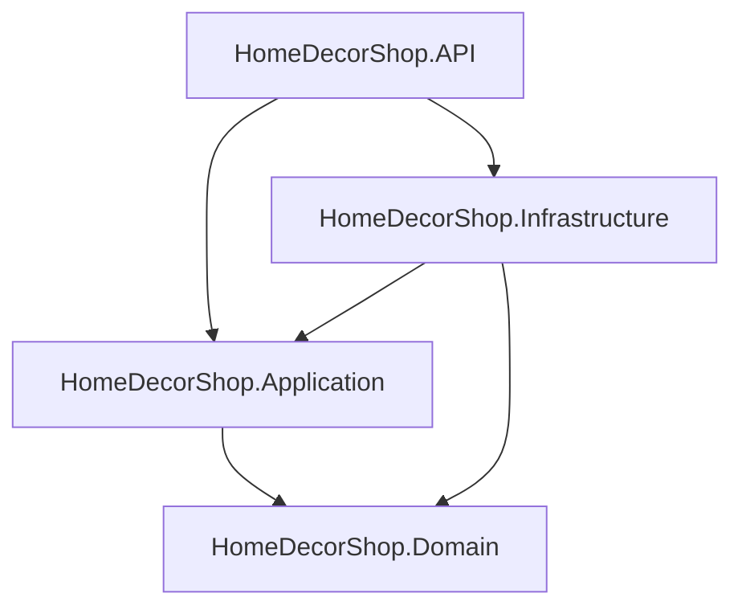

# Code Wiki — ShopdecorBee (BeeShop / HomeDecorShop)

## 1) Tổng quan

Repo gồm 3 phần chính:

- Backend API: `.NET 9` (solution `HomeDecorShop/HomeDecorShop.sln`) theo kiểu tách layer `API / Application / Domain / Infrastructure`.
- Frontend chính (shopper + admin dashboard trong cùng app): Angular (`frontend/`) theo cấu trúc `core/ + features/ + shared/`.
- Admin frontend riêng: Angular skeleton (`admin-frontend/`) hiện gần như chưa có nghiệp vụ.

Luồng chạy local chuẩn có sẵn trong [HUONG_DAN_CHAY.md](file:///c:/Users/PC/OneDrive/Documents/ShopdecorBee-main/HUONG_DAN_CHAY.md).

## 2) Cấu trúc thư mục

```text
ShopdecorBee-main/
  HomeDecorShop/                      # Backend (.NET)
    HomeDecorShop.API/                # Web API (controllers, auth, swagger, startup)
    HomeDecorShop.Application/        # Use-cases/services, DTOs, exceptions, repository abstractions
    HomeDecorShop.Domain/             # Entities + Enums (core model)
    HomeDecorShop.Infrastructure/     # EF Core DbContext, migrations, repositories SQL, integrations
    HomeDecorShop.sln

  frontend/                           # Angular app chính (shopper + admin dashboard route)
  admin-frontend/                     # Angular app admin riêng (skeleton)

  docker-compose.sql.yml              # SQL Server container
  HUONG_DAN_CHAY.md                   # Hướng dẫn chạy local
  README.md                           # Ghi chú ngắn (credentials demo)
```

## 3) Kiến trúc tổng thể

### 3.1 Backend (Clean-ish layering)

**Tầng & trách nhiệm**

- **HomeDecorShop.API (Presentation)**: nhận HTTP request, map route → service, áp dụng auth/authorization, CORS, swagger, exception handling.
- **HomeDecorShop.Application (Use-cases)**: chứa business logic “mỏng” dạng service; DTO vào/ra; định nghĩa abstraction repository/service.
- **HomeDecorShop.Domain (Model)**: entity + enums, không phụ thuộc EF/HTTP.
- **HomeDecorShop.Infrastructure (Persistence/Integrations)**: EF Core DbContext + migrations; repository EF; email service, repository settings/marketing.

**Dependency graph (project reference)**



Các tham chiếu này thể hiện rõ trong:

- [HomeDecorShop.API.csproj](file:///c:/Users/PC/OneDrive/Documents/ShopdecorBee-main/HomeDecorShop/HomeDecorShop.API/HomeDecorShop.API.csproj#L16-L20)
- [HomeDecorShop.Application.csproj](file:///c:/Users/PC/OneDrive/Documents/ShopdecorBee-main/HomeDecorShop/HomeDecorShop.Application/HomeDecorShop.Application.csproj#L1-L10)
- [HomeDecorShop.Infrastructure.csproj](file:///c:/Users/PC/OneDrive/Documents/ShopdecorBee-main/HomeDecorShop/HomeDecorShop.Infrastructure/HomeDecorShop.Infrastructure.csproj#L1-L16)

### 3.2 Frontend chính (Angular feature-first)

Theo [ARCHITECTURE.md](file:///c:/Users/PC/OneDrive/Documents/ShopdecorBee-main/frontend/ARCHITECTURE.md), frontend đi theo hướng:

- `src/core/`: cross-cutting (api config/endpoints, guards, models, mock-data).
- `src/features/<domain>/`: mỗi domain gồm `components/` (UI + route shell) và `data-access/` (facade/store, HTTP, state).
- `src/shared/components/`: shell & UI dùng lại.

Routing tập trung ở [app.routes.ts](file:///c:/Users/PC/OneDrive/Documents/ShopdecorBee-main/frontend/src/app.routes.ts#L1-L33); route `/admin` có `adminGuard`.

## 4) Backend — module chính & key classes

### 4.1 Entry point & middleware

- Entry point: [Program.cs](file:///c:/Users/PC/OneDrive/Documents/ShopdecorBee-main/HomeDecorShop/HomeDecorShop.API/Program.cs#L8-L64)
  - Đăng ký DI layer: `AddApplication()`, `AddInfrastructure()` ([Program.cs:L17-L18](file:///c:/Users/PC/OneDrive/Documents/ShopdecorBee-main/HomeDecorShop/HomeDecorShop.API/Program.cs#L17-L18))
  - CORS policy “Frontend” cho các origin local ([Program.cs:L24-L35](file:///c:/Users/PC/OneDrive/Documents/ShopdecorBee-main/HomeDecorShop/HomeDecorShop.API/Program.cs#L24-L35))
  - Auto migrate DB khi start: `app.InitializeDatabase()` ([Program.cs:L41](file:///c:/Users/PC/OneDrive/Documents/ShopdecorBee-main/HomeDecorShop/HomeDecorShop.API/Program.cs#L41-L41)) → [DatabaseStartupExtensions](file:///c:/Users/PC/OneDrive/Documents/ShopdecorBee-main/HomeDecorShop/HomeDecorShop.API/Startup/DatabaseStartupExtensions.cs#L6-L14)
  - Swagger UI mount mặc định và redirect `/` → `/swagger` ([Program.cs:L50-L60](file:///c:/Users/PC/OneDrive/Documents/ShopdecorBee-main/HomeDecorShop/HomeDecorShop.API/Program.cs#L50-L60))

### 4.2 Dependency Injection (DI)

- Đăng ký service use-case ở [ApplicationDependencyInjection](file:///c:/Users/PC/OneDrive/Documents/ShopdecorBee-main/HomeDecorShop/HomeDecorShop.Application/DependencyInjection/ApplicationDependencyInjection.cs#L6-L24)
  - Ví dụ: `IProductService → ProductService`, `IUserService → UserService`, `IPaymentService → PaymentService`, ...
- Đăng ký repository/integration ở [InfrastructureDependencyInjection](file:///c:/Users/PC/OneDrive/Documents/ShopdecorBee-main/HomeDecorShop/HomeDecorShop.Infrastructure/DependencyInjection/InfrastructureDependencyInjection.cs#L6-L23)
  - Ví dụ: `IProductRepository → SqlProductRepository`, `IUserRepository → SqlUserRepository`, `IEmailService → EmailService`, ...

### 4.3 Authentication / Authorization

Backend dùng custom authentication scheme dựa trên token (không phải JWT).

- Setup scheme: [AuthenticationStartupExtensions](file:///c:/Users/PC/OneDrive/Documents/ShopdecorBee-main/HomeDecorShop/HomeDecorShop.API/Startup/AuthenticationStartupExtensions.cs#L5-L22)
- Token validation: [TokenAuthenticationHandler](file:///c:/Users/PC/OneDrive/Documents/ShopdecorBee-main/HomeDecorShop/HomeDecorShop.API/Authentication/TokenAuthenticationHandler.cs#L10-L44)
  - Đọc token từ request → tra `IUserRepository.GetByToken(token)` ([TokenAuthenticationHandler.cs:L19-L29](file:///c:/Users/PC/OneDrive/Documents/ShopdecorBee-main/HomeDecorShop/HomeDecorShop.API/Authentication/TokenAuthenticationHandler.cs#L19-L29))
  - Gắn role claim để phân quyền `[Authorize(Roles=...)]` ([TokenAuthenticationHandler.cs:L31-L37](file:///c:/Users/PC/OneDrive/Documents/ShopdecorBee-main/HomeDecorShop/HomeDecorShop.API/Authentication/TokenAuthenticationHandler.cs#L31-L37))

Swagger security được khai báo tại [SwaggerStartupExtensions](file:///c:/Users/PC/OneDrive/Documents/ShopdecorBee-main/HomeDecorShop/HomeDecorShop.API/Startup/SwaggerStartupExtensions.cs#L6-L29) (header `Authorization: Bearer <token>`).

### 4.4 Persistence: EF Core DbContext + migrations + repositories

- DbContext: [AppDbContext](file:///c:/Users/PC/OneDrive/Documents/ShopdecorBee-main/HomeDecorShop/HomeDecorShop.Infrastructure/Persistence/AppDbContext.cs#L6-L235)
  - DbSets tiêu biểu: `Users`, `Products`, `Categories`, `Orders`, `Payments`, `Wallets`, `ProductReviews`, ...
  - Mapping quan trọng: unique index (`Email`, `OrderNumber`, `TransactionCode`, `Slug`...), precision decimal (`Price`, `TotalAmount`, ...)
- Migrations: `HomeDecorShop.Infrastructure/Migrations/*` (EF Core).
- Repository pattern:
  - Interface nằm trong `HomeDecorShop.Application` (vd. `IProductRepository`)
  - Implement nằm trong `HomeDecorShop.Infrastructure/Repositories` (vd. [SqlProductRepository](file:///c:/Users/PC/OneDrive/Documents/ShopdecorBee-main/HomeDecorShop/HomeDecorShop.Infrastructure/Repositories/SqlProductRepository.cs#L7-L68))

### 4.5 Controllers & services (điểm vào API)

Các controller chính nằm tại [HomeDecorShop.API/Controllers](file:///c:/Users/PC/OneDrive/Documents/ShopdecorBee-main/HomeDecorShop/HomeDecorShop.API/Controllers):

- Auth/account/user: [AuthController](file:///c:/Users/PC/OneDrive/Documents/ShopdecorBee-main/HomeDecorShop/HomeDecorShop.API/Controllers/AuthController.cs#L8-L61), `AccountController`, `UsersController`, `AddressesController`
- Catalog: [ProductsController](file:///c:/Users/PC/OneDrive/Documents/ShopdecorBee-main/HomeDecorShop/HomeDecorShop.API/Controllers/ProductsController.cs#L8-L121), `CategoriesController`
- Cart/order: `CartController`, `OrdersController`, `AdminOrdersController`
- Payment/wallet: `PaymentsController`, `WalletController`
- Admin/ops: `DashboardController`, `MarketingController`, `SettingsController`, `UploadController`
- Seed/maintenance: `MaintenanceController` (POST `/api/Maintenance/seed/all`)

Một số “key flows” tiêu biểu:

- **Auth**
  - `POST /api/auth/register` & `POST /api/auth/login`: [AuthController](file:///c:/Users/PC/OneDrive/Documents/ShopdecorBee-main/HomeDecorShop/HomeDecorShop.API/Controllers/AuthController.cs#L15-L38)
  - Logic chính: [UserService.Register/Login](file:///c:/Users/PC/OneDrive/Documents/ShopdecorBee-main/HomeDecorShop/HomeDecorShop.Application/Services/UserService.cs#L25-L88)
- **Product search + CRUD**
  - API: [ProductsController.GetAll/Create/Update](file:///c:/Users/PC/OneDrive/Documents/ShopdecorBee-main/HomeDecorShop/HomeDecorShop.API/Controllers/ProductsController.cs#L14-L92)
  - Use-case: [ProductService.Search/Create/Update](file:///c:/Users/PC/OneDrive/Documents/ShopdecorBee-main/HomeDecorShop/HomeDecorShop.Application/Services/ProductService.cs#L16-L176)
  - Repo: [SqlProductRepository.GetAll/GetById/Create/Update](file:///c:/Users/PC/OneDrive/Documents/ShopdecorBee-main/HomeDecorShop/HomeDecorShop.Infrastructure/Repositories/SqlProductRepository.cs#L16-L54)

## 5) Frontend — module chính & key files

### 5.1 Routing

- Routes tập trung tại [app.routes.ts](file:///c:/Users/PC/OneDrive/Documents/ShopdecorBee-main/frontend/src/app.routes.ts#L18-L33)
  - `/admin` bị chặn bởi [adminGuard](file:///c:/Users/PC/OneDrive/Documents/ShopdecorBee-main/frontend/src/core/guards/admin.guard.ts#L5-L14)

### 5.2 API endpoints & auth session

- Base URL + header conventions: [api.config.ts](file:///c:/Users/PC/OneDrive/Documents/ShopdecorBee-main/frontend/src/core/api/api.config.ts#L1-L8)
- Endpoint registry: [api-endpoints.ts](file:///c:/Users/PC/OneDrive/Documents/ShopdecorBee-main/frontend/src/core/api/api-endpoints.ts#L5-L169)
- Auth orchestration: [AuthFacade](file:///c:/Users/PC/OneDrive/Documents/ShopdecorBee-main/frontend/src/features/auth/data-access/auth.facade.ts#L50-L167)
  - Restore session từ `localStorage('token')` và gọi `/api/account/profile` ([auth.facade.ts:L70-L118](file:///c:/Users/PC/OneDrive/Documents/ShopdecorBee-main/frontend/src/features/auth/data-access/auth.facade.ts#L70-L118))

### 5.3 “Mock-first” vs “API-backed” hiện tại

Repo đang tồn tại 2 cách gọi dữ liệu:

- `core/services/api.service.ts`: có fallback sang mock-data nếu API lỗi (vd. products/categories/reviews/feedbacks). Xem [ApiService](file:///c:/Users/PC/OneDrive/Documents/ShopdecorBee-main/frontend/src/core/services/api.service.ts#L90-L195)
- `features/auth/data-access/auth.facade.ts`: gọi API thật bằng `HttpClient` + ProblemDetails mapping.

Khi viết mới, nên chọn 1 hướng thống nhất theo domain (thường dùng `apiEndpoints + facade/store`).

## 6) Hướng dẫn chạy project (local)

Các bước chuẩn đã có trong [HUONG_DAN_CHAY.md](file:///c:/Users/PC/OneDrive/Documents/ShopdecorBee-main/HUONG_DAN_CHAY.md#L1-L52). Tóm tắt:

### 6.1 Yêu cầu môi trường

- Docker Desktop (để chạy SQL Server container)
- .NET SDK 9
- Node.js + npm (phù hợp Angular 21)

### 6.2 SQL Server (Docker)

- Chạy:
  - `docker compose -f docker-compose.sql.yml up -d`
- File compose: [docker-compose.sql.yml](file:///c:/Users/PC/OneDrive/Documents/ShopdecorBee-main/docker-compose.sql.yml#L1-L22)
  - Nên đổi mật khẩu SA và không commit token/secret vào repo (nếu dùng thật).

### 6.3 Backend API

- Restore & chạy:
  - `dotnet restore HomeDecorShop\HomeDecorShop.sln`
  - `cd HomeDecorShop\HomeDecorShop.API`
  - `dotnet run --launch-profile http`
- DB migrate:
  - App có `db.Database.Migrate()` khi start ([DatabaseStartupExtensions](file:///c:/Users/PC/OneDrive/Documents/ShopdecorBee-main/HomeDecorShop/HomeDecorShop.API/Startup/DatabaseStartupExtensions.cs#L6-L14))
  - Nếu cần chạy tay (theo tip trong [HUONG_DAN_CHAY.md](file:///c:/Users/PC/OneDrive/Documents/ShopdecorBee-main/HUONG_DAN_CHAY.md#L64-L66)):
    - `dotnet ef database update --project HomeDecorShop.Infrastructure --startup-project HomeDecorShop.API`
- Seed data:
  - `POST http://localhost:5020/api/Maintenance/seed/all`

### 6.4 Frontend chính

- `cd frontend`
- `npm install`
- `npm run dev -- --host 127.0.0.1`

### 6.5 URLs

- Frontend: `http://127.0.0.1:3000`
- Backend: `http://localhost:5020`
- Swagger: `http://localhost:5020/swagger`

## 7) Làm theo “cái hình” thì cần làm gì?

Hình bạn gửi mô tả một quy trình làm việc/devops điển hình cho team backend (có thể mở rộng cho cả frontend). Để “làm được như hình”, bạn cần chuẩn bị các mảnh sau:

- **1) Git workflow (Member ↔ GitHub)**
  - Mỗi thành viên làm việc trên branch (feature/bugfix), commit thường xuyên, push lên GitHub, mở Pull Request.
  - Quy ước tối thiểu: `main`/`develop` (hoặc chỉ `main`) + branch theo task Jira.

- **2) CI pipeline (Auto build trên GitHub Server)**
  - Tạo workflow CI (thường là GitHub Actions) để:
    - Build backend: `dotnet restore` + `dotnet build` (+ `dotnet test` nếu có test).
    - Build frontend: `npm ci` + `npm run build` (nếu deploy FE).
  - Repo hiện chưa có `.github/workflows/*`, nên phần này bạn cần tạo mới.

- **3) CD/Deploy sang BE server (pipeline → BE abc.com)**
  - Chọn cách deploy:
    - Deploy bằng Docker (đóng gói API thành container) hoặc
    - Publish artifact (`dotnet publish`) rồi copy lên server + restart service.
  - Cần chuẩn bị secrets cho pipeline (SSH key, server host/user, connection strings, v.v.).

- **4) OpenAPI/Swagger làm hợp đồng API**
  - Backend đã có Swagger sẵn ở `/swagger` ([Program.cs](file:///c:/Users/PC/OneDrive/Documents/ShopdecorBee-main/HomeDecorShop/HomeDecorShop.API/Program.cs#L50-L57)).
  - Bước tiếp theo theo “đúng bài”: export OpenAPI spec và dùng nó để đồng bộ test/contract (Postman hoặc tool khác).

- **5) Postman test tự động (Postman → HTTP → BE)**
  - Chuẩn bị Postman Collection + Environment (hiện repo chưa có file `*.postman_collection.json`).
  - Pipeline chạy test bằng Newman (CLI của Postman) để hit API thật trên server sau deploy.

- **6) Jira task + auto log**
  - Mỗi PR gắn với ticket Jira.
  - Pipeline có thể:
    - Update trạng thái ticket (In Progress → Done),
    - Comment log build/test/deploy,
    - Đính kèm link swagger / link deploy.
  - Cần Jira API token + mapping issue key (thường lấy từ branch name/commit message).

Nếu bạn cho mình biết bạn đang dùng GitHub Actions hay GitLab CI, và server deploy là Windows hay Linux, mình có thể đề xuất skeleton pipeline phù hợp với repo này.

