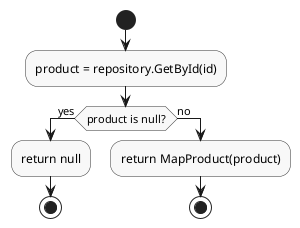

# CFG (Control Flow Graph) - PlantUML Files

Thư mục này chứa các file PlantUML (.puml) để vẽ Control Flow Graph (CFG) cho các hàm trong White-box Testing assignment.

## Danh sách file CFG

### UserService - Auth (5 hàm)
- `UserService_Register.puml`
- `UserService_Login.puml`
- `UserService_GetByToken.puml`
- `UserService_UpdateProfile.puml`
- `UserService_ConfirmEmail.puml`

### UserService - Admin (5 hàm)
- `UserService_GetAll.puml`
- `UserService_GetById.puml`
- `UserService_UpdateRole.puml`
- `UserService_ToggleStatus.puml`
- `UserService_Delete.puml`

### CartService (5 hàm)
- `CartService_GetCurrent.puml`
- `CartService_AddItem.puml`
- `CartService_UpdateItem.puml`
- `CartService_RemoveItem.puml`
- `CartService_Clear.puml`

### ProductService (5 hàm)
- `ProductService_GetById.puml`
- `ProductService_Search.puml`
- `ProductService_Create.puml`
- `ProductService_Update.puml`
- `ProductService_Delete.puml`

### CategoryService (5 hàm)
- `CategoryService_GetAll.puml`
- `CategoryService_GetById.puml`
- `CategoryService_Create.puml`
- `CategoryService_Update.puml`
- `CategoryService_Delete.puml`

### OrderService (5 hàm)
- `OrderService_GetMine.puml`
- `OrderService_GetById.puml`
- `OrderService_PlaceOrder.puml`
- `OrderService_Cancel.puml`
- `OrderService_UpdateStatus.puml`

### PaymentService (5 hàm)
- `PaymentService_GetMine.puml`
- `PaymentService_GetByOrderId.puml`
- `PaymentService_GetById.puml`
- `PaymentService_CreateVnPayPayment.puml`
- `PaymentService_Process.puml`

### WalletService (5 hàm)
- `WalletService_GetOrCreate.puml`
- `WalletService_Deposit.puml`
- `WalletService_Withdraw.puml`
- `WalletService_PayOrder.puml`
- `WalletService_GetTransactions.puml`

## Cách sử dụng PlantUML

### Cách 1: Online (không cần cài đặt)
1. Truy cập: https://plantuml.com/zh/activity-diagram-beta
2. Copy nội dung file `.puml` và dán vào ô bên trái
3. Nhấn "Refresh" để xem diagram
4. Nhấn "Download PNG" hoặc "Download SVG" để tải về

### Cách 2: VS Code Extension
1. Cài extension "PlantUML" từ VS Code Marketplace
2. Mở file `.puml` trong VS Code
3. Nhấn `Alt+D` để preview
4. Nhấn `Ctrl+Shift+P` → "PlantUML: Export Current Diagram" → chọn PNG/SVG

### Cách 3: Command Line (cần cài PlantUML)
1. Tải PlantUML từ: https://plantuml.com/download
2. Cài đặt Java (PlantUML cần Java để chạy)
3. Chạy lệnh:
   ```bash
   java -jar plantuml.jar ProductService_GetById.puml
   ```
   Hoặc export PNG:
   ```bash
   java -jar plantuml.jar -tpng ProductService_GetById.puml
   ```

## Định dạng file PlantUML

File PlantUML sử dụng Activity Diagram để biểu diễn CFG:
- `start` - Điểm bắt đầu
- `stop` - Điểm kết thúc
- `:action;` - Thao tác/hành động
- `if (condition) then (yes) ... else (no) ... endif` - Nhánh điều kiện
- `repeat ... repeat while` - Vòng lặp

## Ví dụ



## Ghi chú cho báo cáo

Các file CFG này được tạo dựa trên code nguồn thực tế của các Service methods. Mỗi file tương ứng với một hàm cần test theo assignment WHITEBOX_ASSIGNMENT.txt.

Khi làm báo cáo:
1. Export CFG sang PNG/SVG
2. Chèn vào báo cáo
3. Liệt kê các nhánh if/else từ CFG
4. Tạo bảng Test Case tương ứng với từng nhánh
