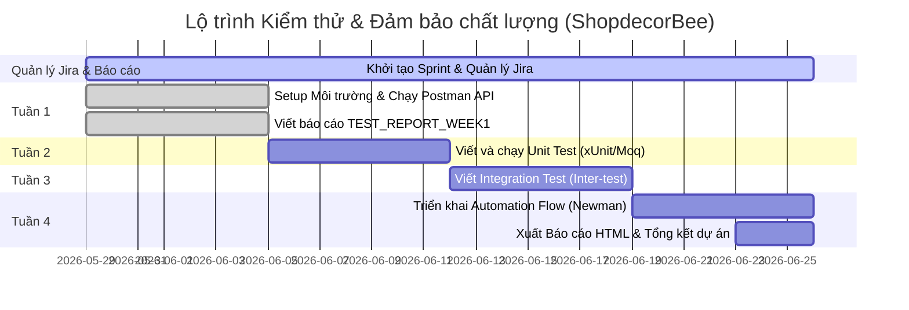

# Kế Hoạch Dự Án Kiểm Thử & Đảm Bảo Chất Lượng (QA) — ShopdecorBee

Bản kế hoạch này được thiết lập dựa trên yêu cầu từ giảng viên **Nguyễn Văn Chiến** và danh sách 7 thẻ nhiệm vụ Jira của **Tuần 1 (KCPM-19 đến KCPM-25)**. Mục tiêu là giúp bạn hoàn thành toàn bộ các yêu cầu kiểm thử cho dự án ShopdecorBee một cách chuyên nghiệp, bài bản nhất mà **không làm thay đổi hay sửa đổi mã nguồn** của ứng dụng.

---

## 📌 Tổng Quan Bản Đồ Công Việc 4 Tuần

Sơ đồ dưới đây thể hiện sự phân bổ công việc qua từng tuần dựa trên các chỉ dẫn từ hình ảnh của bạn:



---

## 📅 CHI TIẾT KẾ HOẠCH TỪNG TUẦN

### 🐝 TUẦN 1: Setup Hệ Thống, Thực Thi API Test Cases & Viết Test Report

> [!IMPORTANT]
> **Mục tiêu**: Thiết lập toàn bộ dự án chạy cục bộ, chạy bộ sưu tập Postman có sẵn để kiểm tra 7 dịch vụ cốt lõi, cập nhật trạng thái các thẻ Jira tương ứng và điền kết quả vào báo cáo tuần 1.

#### 1. Thiết lập môi trường chạy dự án (Local Setup)
Làm theo đúng hướng dẫn chạy trong file [HUONG_DAN_CHAY.md](HUONG_DAN_CHAY.md):
1. **SQL Server**: Khởi động database qua Docker:
   ```powershell
   docker compose -f docker-compose.sql.yml up -d
   ```
2. **Backend**: Restore & Run dự án .NET API:
   ```powershell
   dotnet restore HomeDecorShop\HomeDecorShop.sln
   cd HomeDecorShop\HomeDecorShop.API
   dotnet run --launch-profile http
   ```
3. **Seed Dữ Liệu**: Gọi API seed dữ liệu mẫu để sẵn sàng kiểm thử:
   ```powershell
   Invoke-RestMethod -Method Post http://localhost:5020/api/Maintenance/seed/all
   ```
4. **Frontend**: Khởi động giao diện người dùng:
   ```powershell
   cd frontend
   npm install
   npm run dev -- --host 127.0.0.1
   ```

#### 2. Thực thi Postman API Testing (7 Core Services)
Import các file từ folder `postman/` vào công cụ Postman:
- Environment: `postman/BeeShop.local.postman_environment.json`
- Collection: `postman/BeeShop_Week1.postman_collection.json`

Tiến hành chạy kiểm thử cho **7 dịch vụ chính** tương ứng với **7 thẻ Jira** trong hình ảnh của bạn:

| Mã Thẻ Jira | Dịch Vụ Cần Kiểm Thử | Các Test Case API Cần Chạy & Xác Minh | Trạng Thái Thẻ |
| :--- | :--- | :--- | :---: |
| **KCPM-19** | **Auth & User Service** | Đăng ký, đăng nhập, thông tin cá nhân (Profile), cập nhật Profile, đổi mật khẩu (*Lưu ý: Đổi mật khẩu backend chưa cài đặt thực tế*). | `✅ Đã check` |
| **KCPM-20** | **Product Service** | Lấy danh sách sản phẩm, chi tiết sản phẩm, tìm kiếm và bộ lọc theo danh mục. | `✅ Đã check` |
| **KCPM-21** | **Category Service** | Xem danh sách danh mục sản phẩm, xem chi tiết danh mục, kiểm thử nhóm danh mục. | `✅ Đã check` |
| **KCPM-22** | **Cart Service** | Lấy thông tin giỏ hàng, thêm sản phẩm vào giỏ, cập nhật số lượng, xóa sản phẩm, xóa toàn bộ giỏ hàng. | `✅ Đã check` |
| **KCPM-23** | **Order Service** | Thêm sản phẩm -> Đặt đơn hàng mới, xem danh sách đơn hàng, xem chi tiết đơn hàng, admin duyệt đơn, khách hủy đơn. | `✅ Đã check` |
| **KCPM-24** | **Payment Service** | Xử lý thanh toán (COD hoặc Ví), xem danh sách giao dịch thanh toán cá nhân, xem chi tiết thanh toán. | `✅ Đã check` |
| **KCPM-25** | **Wallet Service** | Kiểm tra số dư ví điện tử cá nhân, nạp tiền trực tiếp vào ví, rút tiền, truy vấn lịch sử giao dịch ví. | `✅ Đã check` |

#### 3. Viết Báo Cáo Tuần 1
Mở file [test-reports/week1/TEST_REPORT_WEEK1.md](test-reports/week1/TEST_REPORT_WEEK1.md) lên và điền kết quả thực tế sau khi chạy Postman:
- Đếm tổng số test case **Passed** / **Failed** / **N/A** (Không áp dụng do tính năng chưa phát triển).
- *Ví dụ lỗi cần ghi nhận*: API `POST /api/account/change-password` trả về lỗi `404 Not Found` (do Backend chưa xây dựng endpoint này).

---

### 🧪 TUẦN 2: Thiết Kế & Thực Thi Unit Test (Kiểm Thử Đơn Vị)

> [!NOTE]
> Giải quyết phần **"Unit test(?)"** trong yêu cầu của thầy Nguyễn Văn Chiến. Ở tuần này, bạn sẽ tập trung thiết kế các kịch bản kiểm thử đơn vị cho code logic backend.

1. **Thiết lập Dự án Test**:
   - Sử dụng framework **xUnit** và thư viện **Moq** (để giả lập dữ liệu) trong C# .NET.
   - Thêm dự án kiểm thử tên là `HomeDecorShop.UnitTests` vào Solution mà không sửa code chính.
2. **Viết mã Unit Test**:
   - Viết các test class để kiểm thử độc lập cho các lớp Service nghiệp vụ như:
     - `AuthServiceTests.cs` (kiểm tra logic mã hóa mật khẩu, kiểm tra trùng lặp email).
     - `ProductServiceTests.cs` (kiểm tra tính hợp lệ của phân trang, logic tìm kiếm).
     - `CartServiceTests.cs` (kiểm tra logic tăng/giảm số lượng sản phẩm, giới hạn tồn kho).
3. **Thực thi và Đo lường độ bao phủ (Coverage)**:
   - Chạy lệnh `dotnet test` trong terminal để kiểm tra kết quả.
   - Sử dụng công cụ `coverlet` để đo độ phủ của mã nguồn, đảm bảo phần lớn logic nghiệp vụ chính được bao phủ (> 80%).

---

### 🔗 TUẦN 3: Thiết Kế & Thực Thi Integration Test (Kiểm Thử Tích Hợp)

> [!NOTE]
> Giải quyết phần **"Inter-test(?)"** trong yêu cầu của thầy Nguyễn Văn Chiến. Kiểm thử tích hợp giúp đảm bảo các service hoạt động trơn tru khi tương tác với nhau và với Database thật.

1. **Thiết lập Integration Test Suite**:
   - Sử dụng thư viện `Microsoft.AspNetCore.Mvc.Testing` để khởi động máy chủ API ảo trong bộ nhớ (InMemory hoặc kết nối Database Test).
2. **Thiết kế luồng tích hợp (End-to-End Business Flow)**:
   - **Luồng 1: Mua hàng bằng COD**
     - Đăng nhập -> Thêm sản phẩm vào giỏ -> Tạo đơn hàng -> Thực hiện thanh toán COD -> Kiểm tra trạng thái đơn hàng chuyển sang `Chờ xử lý (Processing)`.
   - **Luồng 2: Mua hàng bằng Ví điện tử (Wallet)**
     - Đăng nhập -> Kiểm tra số dư -> Nạp tiền vào ví -> Đặt đơn hàng -> Thực hiện thanh toán bằng Ví -> Kiểm tra số dư ví bị trừ chính xác và trạng thái thanh toán chuyển sang `Đã thanh toán (Paid)`.
3. **Thực thi**:
   - Chạy các integration test để phát hiện các lỗi bất đồng bộ hoặc xung đột khóa ngoại khi lưu cơ sở dữ liệu thực tế.

---

### 🤖 TUẦN 4: Triển Khai Luồng Tự Động & Xuất Báo Cáo (Automation Flow & Reports)

> [!TIP]
> Giải quyết phần **"Triển khai flow auto. ?"** và **"Reports (?)"** trong yêu cầu của thầy Nguyễn Văn Chiến. Biến toàn bộ quá trình kiểm thử của bạn thành một luồng chạy hoàn toàn tự động, chuyên nghiệp!

#### 1. Tự động hóa kiểm thử API bằng Newman
**Newman** là công cụ CLI giúp chạy bộ sưu tập Postman tự động mà không cần mở giao diện đồ họa.
- Cài đặt Newman qua Node.js:
  ```bash
  npm install -g newman
  npm install -g newman-reporter-htmlextra
  ```
- Lệnh chạy kiểm thử tự động và xuất báo cáo HTML cực đẹp:
  ```bash
  newman run postman/ShopdecorBee-7-Services.postman_collection.json -e postman/BeeShop.local.postman_environment.json -r htmlextra --reporter-htmlextra-export test-reports/week4/automation_report.html
  ```

#### 2. Triển khai luồng tự động (Auto Flow / CI)
Tạo một file kịch bản chạy tự động (ví dụ: file PowerShell `run-auto-tests.ps1` hoặc thiết lập luồng GitHub Actions trong `.github/workflows/tests.yml` nếu dự án được đưa lên GitHub):
- Tự khởi động SQL Server (Docker).
- Tự động chạy Backend API.
- Thực thi toàn bộ Unit Test và Integration Test.
- Thực thi Newman để chạy API Automation Test.
- Tự động gom tất cả báo cáo và gửi/lưu trữ vào thư mục `test-reports/`.

---

## 📈 Hướng Dẫn Quản Lý Dự Án Trên Jira

Để đáp ứng mục tiêu **"Quản lý dự án jira (...)"**:
1. **Tạo Epics trên Jira**:
   - `Epic 1: API Testing & Verification` (Tuần 1)
   - `Epic 2: Unit Testing Core Services` (Tuần 2)
   - `Epic 3: Integration Flow Verification` (Tuần 3)
   - `Epic 4: Test Automation & CI Flow` (Tuần 4)
2. **Quản lý Thẻ**:
   - Với 7 thẻ từ **KCPM-19 đến KCPM-25**, hãy nhóm chúng vào Sprint 1 (Tuần 1).
   - Kéo các thẻ sang trạng thái **Done** sau khi đã chạy thành công Postman và điền kết quả vào file `TEST_REPORT_WEEK1.md`.
   - Đối với các tuần tiếp theo, hãy tạo mới các thẻ Task liên quan đến Unit Test, Integration Test và Newman Automation Flow tương tự để theo dõi tiến độ.
